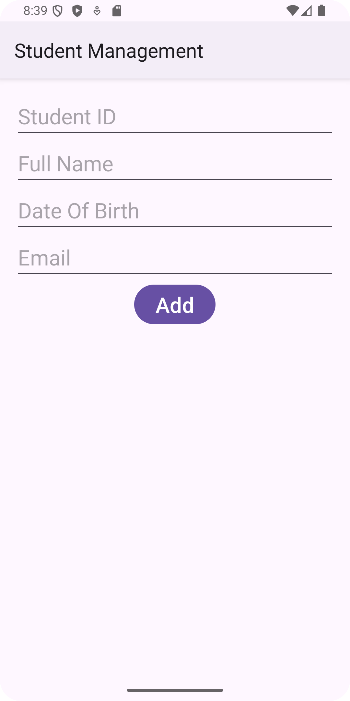

# Student Manager
+ Thiết lập sử dụng thư viện Room để quản lý sinh viên với các thông tin: mssv, họ tên, ngày sinh, email.
+ Sử dụng Recycler View hiển thị danh sách sinh viên ở màn hình chính, danh sách gồm: mssv, hoten.
+ Trên màn hình chính có giao diện cho phép tìm kiếm (lọc) sinh viên theo họ tên hoặc mssv.
+ Trên màn hình chính, thêm Option menu để mở màn hình thêm sinh viên
+ Danh sách cần thêm checkbox cho phép chọn nhiều sinh viên để xóa.
+ Khi nhấn vào 1 sinh viên thì mở màn hình hiển thị thông tin chi tiết của sinh viên, màn hình này có nút để xóa và cập nhật thông tin.
## Ảnh chụp kết quả chạy thử
### Danh sách sinh viên

### Tìm kiếm sinh viên

### Thêm mới sinh viên

### Chọn nhiều sinh viên để xóa

### Xem chi tiết sinh viên

